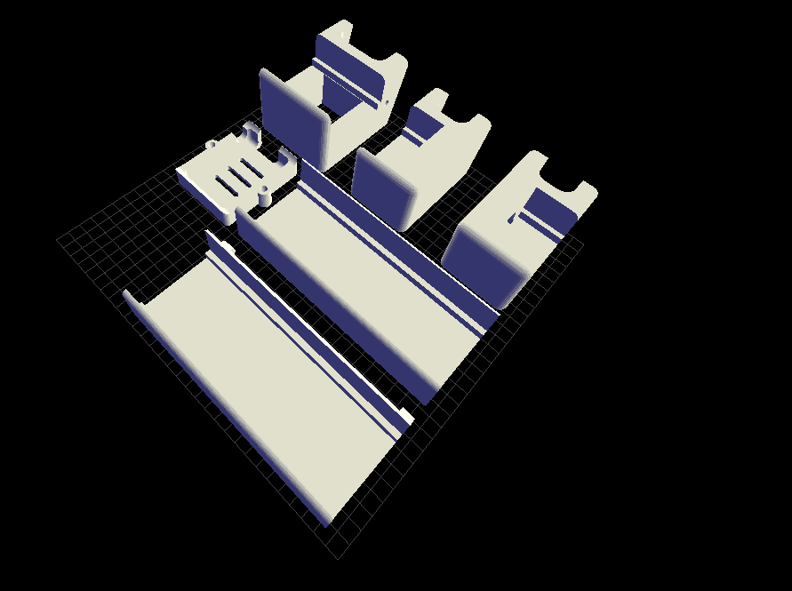

# 8 module 8x8 Dot Matrix stand

This is a 3D STL source of a Double wide Marquee Scroller frame and stand based entirely on the [ESP8266 Double Wide Marquee Scroller News Weather Clock](https://www.thingiverse.com/thing:2989552) model by David Payne. This model is modified slightly to fit the 265 mm length of the Dot matrix module used.

